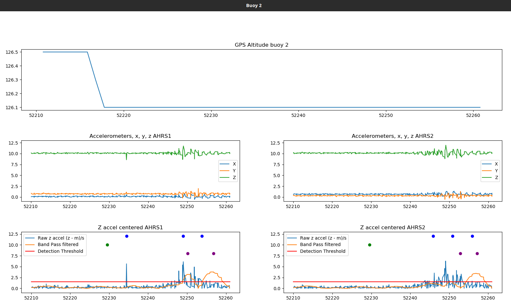

# sillage
Projet guerledan 2022/2023 sous la tutelle de Quentin Brateau.

Jonas Soueidan

Thomas Tacheron 

Ermance Decaudaveine

Hortense Leynier

Oscar Gauvrit

## Objectifs 
Retracer la trajectoire de navires grâce à la détection de leurs sillages.
En positionnant des bouées possédant des GPS et des accéléromètres, il est possible de détecter des vagues de sillages de bateaux, et ainsi connaitre la position de la bouée au moment de la détection. Avec une modélisation de la trajectoire et des sillages, il est possible de determiner leurs trajectoires.

## Réalisation
Pour réaliser ce projet, il a fallu fabriquer nos propres bouées, les configurer, et écrire un code Python capable de récupérer les données de 3 capteurs (2 AHRS et un GPS par bouées) en parallèle. Ensuite, en récupérant les mesures, il est possible en post-processing de déterminer les intervalles d'impact des sillages, et d'extraire les intervalles de position des bouées. Grâce à cela, il est possible de créer un réseau de contracteurs avec des équations d'état pour le déplacement théorique des navires, et d'estimer des zones de positionnements possibles, incertains et impossibles en utilisant un algorithme de type SIVIA.

## Codes
Le code est composé de trois parties.
### Embarqué
Le code embarqué est placé sur les bouées pour effectuer le levé de mesures.
Les codes python *log_post.py*, *class_ahrs.py* et *gps.py* sont les fichiers principaux pour exécuter le code.
Le fichier *config.txt* contient l'ID de la bouée sur laquelle il se trouve, il permet de gérer les chemins et les noms de fichiers de manière plus automatique. Les différents scripts *getX* permettent de récupérer automatiquement les ports de connection des différents capteurs AHRS et GPS pour le code python. Le  script *launch* permet de lancer directement le log des mesures dans un screen, et le script *reattach* permet de récupérer le screen une fois détaché. 

Voici une liste de commandes utiles :
```
# Linux cmds to launch data log on screen:
screen -S sillage_log
python3 sillage_python/Sillage/log_data.py
# Or
./launch

# To detach screen : 
screen -d    # If no python code running
# else :
# Ctrl + a, d

# To reattach :
screen -r sillage_log
# Or
./reattach

# To check screens :
screen -ls

# To kill a screen :
# go in the screen with screen -r
exit

# To setup the AHRS rates, run : 
screen /dev/ttyUSB0 115200    // Make sure the port and baudrate are right !
# When you see the logging in the terminal, press q
# And just follow the numbers
Close with Ctrl-a + k  # Will kill the current screen
```
### Post-Processing de Detection de sillages
Le code *log_post.py* permet de detecter les instants de detection à partir de fichiers logs. Il y a pour l'instant deux méthodes : Traitement par seuil brut des accélérations et Traitement par filtrage fréquentiel. La séconde méthode est pour l'instant utilisée, mais peut etre à terme remplacée par quelque chose de plus précis/performant.
Dans le code *log_post.py*, il est possible de découper temporellement les échantillons à partir de timestamps définis à l'avance. Voici un exemple de code :
```
import numpy as np
import matplotlib.pyplot as plt
from utils import *

time = '15:30:30'   # Boat theoritical passage
f1 = 'log/sillage1_ahrs1_log_2023-02-08_14_29_14.log' #First buoy, AHRS1 log file name

f2 = 'log/sillage1_ahrs2_log_2023-02-08_14_29_14.log' #First buoy, AHRS2 log file name

gps = 'log/sillage1_gps1_log_2023-02-08_14_29_14.log' #First buoy, gps log file name

f3 = 'log/sillage2_ahrs1_log_2023-02-08_14_27_50.log' #Second buoy, AHRS1 log file name

f4 = 'log/sillage2_ahrs2_log_2023-02-08_14_27_50.log' #Second buoy, AHRS2 log file name

gps2 = 'log/sillage2_gps1_log_2023-02-08_14_27_50.log' #Second buoy, gps log file name

gpx = 'log/2023-02-08 15_30_37.gpx'  # Boat GPX file

# For a Single detection (the first one defined in time):
t_begin = '15:30:10' #First slicing timestamp
t_last='15:31:01' #Second slicing timestamp

# For the last Guerledan measures, detection parameters :
seuil = 1.5
delta_p = 51.

# Plotting the data from the files, sliced and the detection points 
plot_buoys2(seuil, delta_p, file1=[f1, f2], file2=[f3, f4], gps_files=[gps, gps2], time=time, gpx=gpx, t_begin=t_begin, t_last=t_last)

# Getting the detections intervals :

t0, t1 = cvt_time(t_begin, t_last)
print('\nDetection buoy 1')
res1, res2, interval1, interval2 = detection2(f1, f2, gps, seuil, delta_p,t_begin=t_begin, t_last=t_last, output='Frequency')
plot_detections([res1, res2], [interval1, interval2], t0, t1)
gps_box1, gps_box2 = get_gps_intervals(f1, f2, gps, seuil, delta_p,t_begin=t_begin, t_last=t_last, output='Frequency')
# print(gps_box1)
write_in_csv('first_detect_ahrs1', interval1, gps_box1)
write_in_csv('first_detect_ahrs2', interval2, gps_box2)


print('\nDetection buoy 2')
res3, res4, interval3, interval4 = detection2(f3, f4, gps2, seuil, delta_p,t_begin=t_begin, t_last=t_last, output='Frequency')
plot_detections([res3, res4], [interval3, interval4], t0, t1)
gps_box3, gps_box4 = get_gps_intervals(f3, f4, gps2, seuil, delta_p,t_begin=t_begin, t_last=t_last, output='Frequency')
# print(gps_box3)
write_in_csv('first_detect_ahrs3', interval3, gps_box3)
write_in_csv('first_detect_ahrs4', interval4, gps_box4)

```
La sortie de ce code donne donc des fichiers CSV à traiter avec les codes intervalles.
On observe également les images suivantes :




### Post-Processing Intervalles
Le code original viens [ce dépot Git](https://github.com/Teusner/WakeBoat).
Après adaptation avec nos intervalles de detections mesurés dans [ce dépot Git](https://github.com/thomastacheron/Sillage), on obtient ceci :

